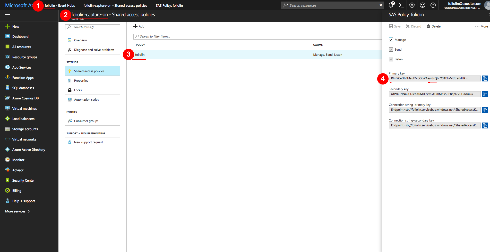

Demo: Send events to Azure Event Hubs using C
=============================================

Prerequisite
------------

1. docker
2. make

Step 1
------

1. Go to [line 37 in ./sender.c](https://github.com/foliolin/Dockerfile/blob/master/event-hub/sender.c#L37 "line 37 in ./sender.c")
2. Replace `` {{1}} ``, `` {{2}} ``, `` {{3}} `` and `` {{4}} `` with 1, 2, 3 and 4 in your Azure Portals according to the 

Step 2
------

```sh
make
```
